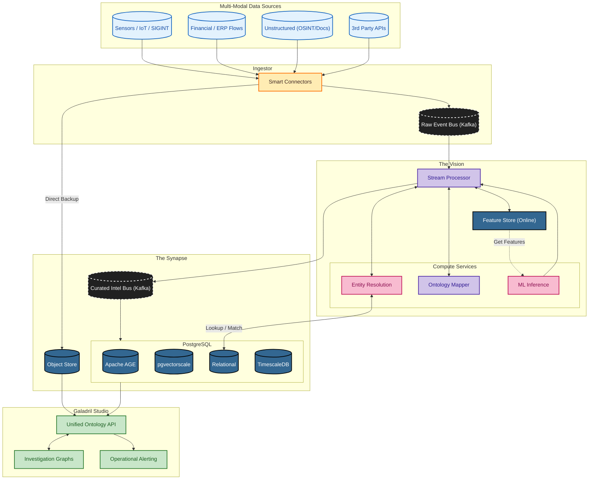

# Galadril ⛲️

[Documentation](https://realhinome.github.io/Galadril/) | 
[GitHub](https://github.com/RealHinome/Galadril)

> *"Things that were, and things that are, and some things that have not yet
> come to pass."*

**Galadril** is an advanced data integration and analytical intelligence
platform designed to provide a "Mirror" of complex systems. Galadril focuses
on **elucidation, foresight, and transparency**.

> [!CAUTION]
> This project is still in its early stages.

## Development
Enter the shell to load the environment:
```bash
nix develop github:RealHinome/Galadril?dir=infrastructure/nix
```

## Deployment
Deploy to NixOS using the provided flake:
```bash
nixos-rebuild switch --flake github:RealHinome/Galadril?dir=infrastructure/nix#server
```

## Targeted architecture



### SOTA Engine: ESKG-enhanced GraphRAG

Galadril implements a reasoning framework based on the Event-State Knowledge
Graph (ESKG), as described in [Zang et al. (2026)](https://doi.org/10.1016/j.eswa.2026.131938).

Galadril represents the system as an evolving heterogeneous graph
$G_t = (V_t, R_t)$, where:
* $V_t = \{S \cup E\}$ is the set of vertices comprising **States** ($S$) and
    **Events** ($E$).
* $R_t \subseteq \{V_t \times \mathcal{T} \times V_t\}$ is the set of relations,
    where $\mathcal{T}$ represents the six fundamental interaction types:
    * **Triggers** ($E \xrightarrow{trig} S$): An event directly initiating a
        new state.
    * **Leads to** ($E_i \xrightarrow{lead} E_j$): A logical or temporal
        sequence between two events.
    * **Evolution** ($S_i \xrightarrow{evol} S_j$): A natural transition or
        progression between two states.
    * **Contain** ($E \supset S$ or $S \supset E$): A hierarchical inclusion of
        an event within a state (or vice-versa).
    * **Occur** ($E \xrightarrow{occ} L, T$): Spatio-temporal anchoring of an
        event to a location and time.
    * **Influence** ($E \xrightarrow{infl} P$): An event modifying a numerical
        property or parameter of an entity.

The core of the ESKG is the triggering mechanism that governs graph evolution.
When an event $E_i$ occurs, it satisfies a transition function $f$ that maps the
previous state to a new one: $$f: (S_{old}, E_i) \rightarrow S_{new}$$

This implies that for every state update in the "Mirror", Galadril enforces a
causal constraint: $$\exists E \in V_t \mid (E, \text{trig}, S_{new}) \in R_t$$
