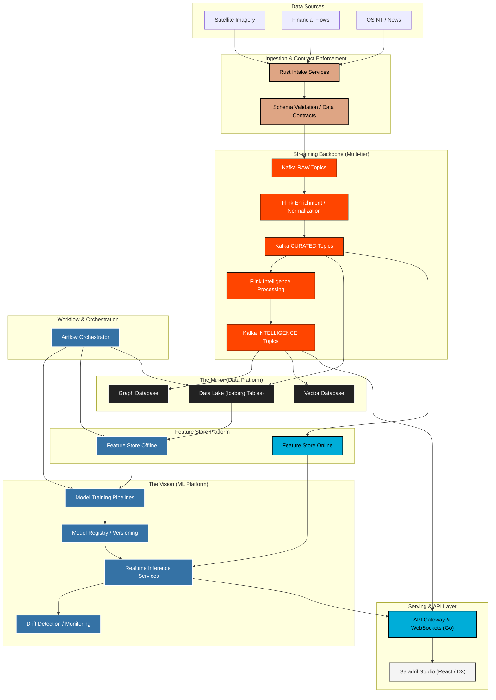

# Galadril ⛲️

> *"Things that were, and things that are, and some things that have not yet
> come to pass."*

**Galadril** is an advanced data integration and analytical intelligence
platform designed to provide a "Mirror" of complex systems. Galadril focuses
on **elucidation, foresight, and transparency**.

> [!CAUTION]
> This project is still in its early stages.

## Targeted architecture

